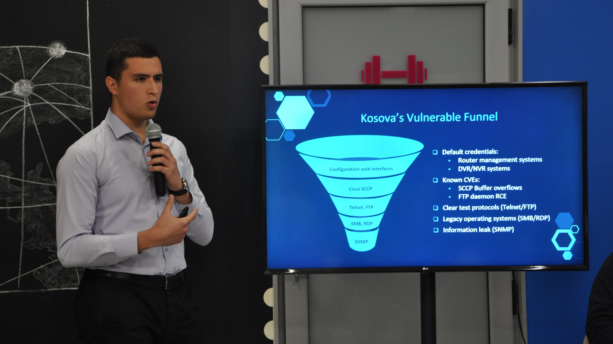
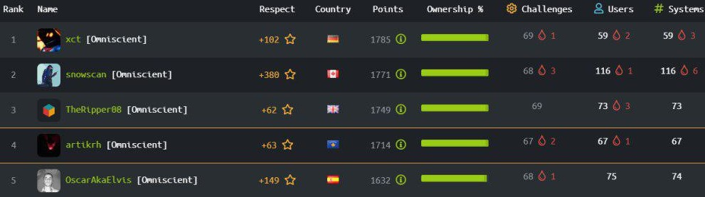

# Blog Feed
### 1. Technical Articles  
 

[Evading AV with Network Sockets / Keylogger RAT](posts/av-evasion-network-sockets)  

<b>August 31, 2020 — </b> 
Compiling and running an unsigned Windows executable and expecting a remote CMD session without any detection is a difficult task to achieve, however, sometimes there are easier ways of bypassing AVs. This article will outline a simple but functional remote 'shell' with keylogging capabilities against a fully up-to-date Windows Defender.

[Weevely Backdoor Analysis / Blue Team DFIR](posts/weevely-backdoor-analysis)  

<b>March 30, 2020 — </b> 
Weevely is a powerful polymorphic backdoor used in web post-explotation; this tool is written in Python and it generates a small obfuscated PHP shell which is then delievered to the targeted web server. The article will lay out it's communication chain and encryption scheme in order to assist blue team operators during a DFIR process.

[Building Android Spyware / Xombie APK](posts/building-android-spyware)  

<b>December 26, 2019 — </b> 
Xombie APK is an Android spyware which works with the latest SDK version (API level 29). This research post will outline some functionalities that can be used for such purposes and for educational use only. The application is part of a larger project—SMS Xombie—which makes use of the GSM network to command and control infected devices.

[Ethereum RPC & IPFS / HTB Chainsaw](posts/htb-chainsaw-writeup)  

<b>November 23, 2019 — </b> 
This article will demonstrate a new vector of attack using Blockchain tools, commencing from an initial CMD injection through Ethereum's RPC interface, SSH keys retrieval using the IPFS protocol, privilege escalation by stealing funds from a smart contract, and file system forensics in the slack space storage.

### 2. Sense Cyber Research Center
[Cybersecurity Awareness Month #BeCyberSmart](https://sense.co.com/2020/10/31/cybersecurity-awareness-month/){:target="_blank"}  
<b>October 31, 2020 — </b> 
This article is part of #NCSAM20 to help protect entities from online fraud and malware. It outlines key cyber-threats and their respective counter-measures in terms of safety tips – relevant to both individuals and businesses during the COVID-19 era.

[A Look Inside Banka Ekonomike's Data Breach](https://sense.co.com/2020/05/01/banka-ekonomike-rks-breach/){:target="_blank"}  
<b>May 1, 2020 — </b> 
A comprehensive overview of the data breach incident at Banka Ekonomike in Kosovo by the DoppelPaymer ransomware. What information has been compromised, who is the entity behind the cyber-attack, and what are the key corporate security lessons?

[Data Protection in Kosovo](https://sense.co.com/2019/08/01/data-protection-ks/){:target="_blank"}  
<b>August 1, 2019 — </b> 
A general outline on how Privacy & Data Protection are defined in Kosovo as well as data protection legislation throughout the years, key legal points, and the supervistory authority along its top court cases.

### 3. Capture the Flag Documentations
- **September 30, 2018 —** [Access / MDB SQL & Stored Credentials](assets/pdfs/Access.pdf)
- **August 28, 2018 —** [SecNotes / SQLi & Password Leak](assets/pdfs/SecNotes.pdf)
- **August 26, 2018 —** [Dab / Memcached Breach & Shared Library Hijack](assets/pdfs/Dab.pdf)
- **August 8, 2018 —** [Reddish / Node-RED, Pivoting & Rsync Abuse](assets/pdfs/Reddish.pdf)
- **August 7, 2018 —** [Waldo / Local File Inclusion & Linux Capabilities](assets/pdfs/Waldo.pdf)
- **July 19, 2018 —** [Hawk / AES CBC Bruteforce, Drupal Reverse Shell & H2 Console](assets/pdfs/Hawk.pdf)
- **June 12, 2018 —** [Stratosphere / Apache Struts Attack & Python Library Hijack](assets/pdfs/Stratosphere.pdf)
- **June 5, 2018 —** [Chatterbox / Achat Buffer Overflow & ACL Modification](assets/pdfs/Chatterbox.pdf)
- **June 2, 2018 —** [Celestial / NodeJS Vulnerability & Cronjob Abuse](assets/pdfs/Celestial.pdf)
- **June 1, 2018 —** [Poison / Exposed SSH key & VNC Takeover](assets/pdfs/Poison.pdf)

# $ whoami

**About me:** I am a Cybersecurity Specialist—from Prishtina, Kosovo—working in the field of Information Security and Data Protection. I completed my studies in Computer Engineering, Computer Networks, and Cyber Security. My key technical skills lie in enterprise security, network and mobile security, digital forensics, malware development and process automation using Python & C/C++.

**Capture the Flag:** I occasionally partake in CTF global events with a main focus on web, cryptography and steganography.

**Hack the Box:** HTB is an online penetration testing platform with more than 400,000 Security Researchers worldwide. My peak rank was the fourth (4th) position globally as seen below.

**Team:** [Cyclone](https://www.hackthebox.eu/home/teams/profile/1219) (Best rank: #2 out of 1931)

### Mentions
- [University of Business and Technology / CSP Academy 2021](/assets/pdfs/UBT_Mobile-Security.pdf)
- [University of Prishtina / Cyber Security Presentation](/assets/pdfs/UP_CyberAttacksFIN.pdf)
- [University of Prishtina / BSc. Diploma Thesis](https://www.linkedin.com/feed/update/urn:li:activity:6736571726630584321/)
- [University of Business and Technology / CSP Academy 2020](/assets/pdfs/UBT_Cyber-Resilience.pdf)
- [ICTSmedia / Albanian ICT Awards VIII](https://ictawards.org/2019/edicioni-i-8-te-i-ict-awards-ndan-cmimet-per-historite-shqiptare-te-suksesit-ne-teknologji/)
- [Wallencore / XOR Regional CTF](https://wallencore.com/wallencore-awards-certificates-of-achievement-to-xorctf74e-2020-contest-winners/)
- [Cacttus Education / Cyber Security Panel](https://cacttus.education/cacttus-education-se-bashku-me-cyber-academy-dhe-cacttus-organizuan-panelin-mbi-sigurine-kibernetike/)
- [Cyber Academy / Hall of Fame](https://cyberacademy.co/#alumnitext)
- [Sentry Cybersecurity / Cyber Defense Week](https://sentry.co.com/2019/06/11/cyber-defense-week-2018/)

### Links
- [hackthebox.eu/profile/41600](https://www.hackthebox.eu/profile/41600)
- [github.com/artikrh](https://github.com/artikrh)
- [linkedin.com/in/artikarahoda/](https://www.linkedin.com/in/artikarahoda/)
- [sense.co.com/cpo_team/arti-karahoda/](https://sense.co.com/cpo_team/arti-karahoda/)

### Contact
- [arti.karahoda@sense.co.com](mailto:arti.karahoda@sense.co.com)
- [PGP: 6250 DB1D 7BBB A441 9840 C3EF 096D E9BF 56A0 EBE0](assets/txt/pgp-pub.txt)

